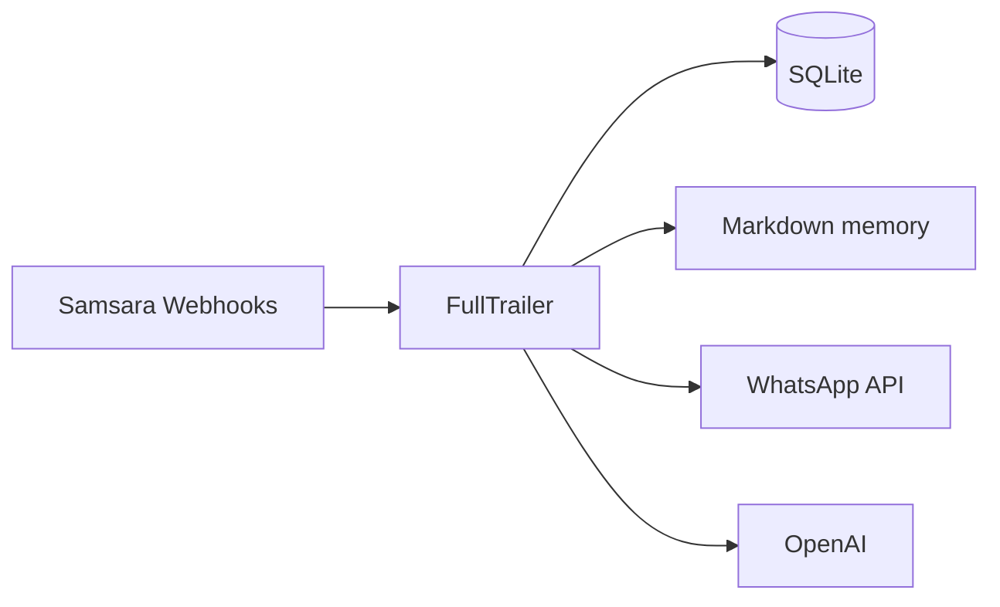

# Arquitectura — FullTrailer

## Visión general

FullTrailer es un servidor HTTP (Axum) que recibe webhooks de Samsara, valida firmas HMAC, procesa eventos en segundo plano y coordina notificaciones por WhatsApp con redacción asistida por IA.

## Componentes

1. **Webhooks (`src/webhooks/`)** — Entrada HTTPS, verificación de firma, parseo JSON y despacho a agentes.
2. **Agentes (`src/agents/`)** — Lógica de negocio: monitoreo de rutas y detección de ausencias.
3. **Integraciones (`src/integrations/`)** — Clientes para WhatsApp Cloud API, OpenAI y API REST de Samsara.
4. **Memoria (`src/memory/`)** — SQLite como fuente de verdad; Markdown por chofer para contexto legible.
5. **Scheduler (`src/scheduler/`)** — Tareas programadas (revisión diaria de ausencias).
6. **Dashboard (`src/dashboard/`)** — Vista HTML en `/` para operadores.

## Flujo de datos

## Seguridad

- Secreto de webhook en Base64; HMAC-SHA256 antes de procesar.
- Tokens y claves solo por variables de entorno (ver `.env.example`).
